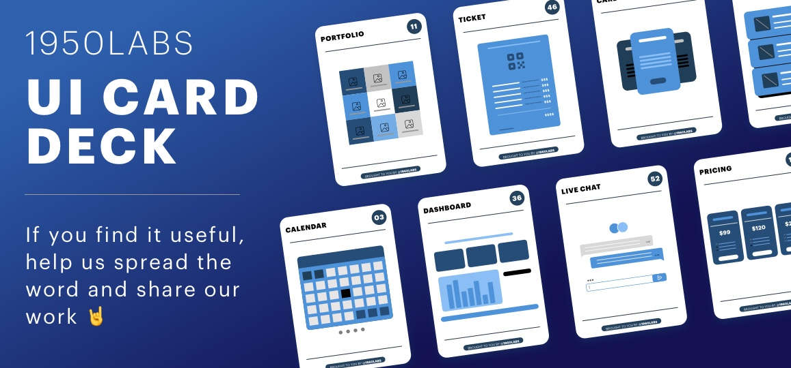

# UI Card Deck
## About the card deck:
Our design team has been working on a collection of user interface cards that represent a module of a web page or app that will help you diagram or think faster about designs or user flows. You can use it to collect client's insights and work in teams too. Please feel free to download and share this product, also you can contact us for collaborations or more cards!

- If you find it useful, help us spread the word and share our work 🤘
- If you would like to know how you can use the cards, check the manual [here](https://github.com/1950Labs/UI-card-deck-1950/blob/main/Co%CC%81mo%20usar%20:%20How%20to%20use/1950CARDS-EN.pdf) 📖
- If you want to contribute or be aware --> contact us at  uiux@1950labs.com 🙌
- If you need this cards in another language: let's collaborate! 🤜 🤛

## About 1950Labs:
1950Labs is a boutique software development shop specialized in remote staffing. Our main strength is with Fintech, Automotive industries and UX/UI Design, using Microsoft technologies and modern front end frameworks like AngularJS, Angular2, ReactJS and Bootstrap and design tools like Sketch and InVision.

We manage the biggest community of developers, designers and testers ( UruguayIT.com ). Due to that, if we don’t have available the talent you need, we can find it faster than any other company in LATAM.

You can check our work on [Dribbble](https://dribbble.com/1950labs) and follow us to find about our new posts and projects!

Please route all business inquiries to hello@1950labs.com.

For any design inquiry please contact us at uiux@1950labs.com
